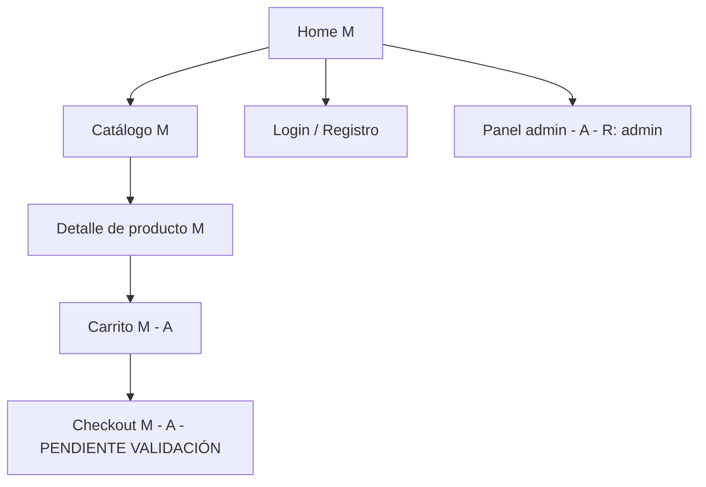

# UX Architecture Skill

La arquitectura de información responde a: ¿dónde está cada cosa y cómo se llega ahí?
Antes de diseñar un botón, hay que saber en qué pantalla vive y cómo el usuario llegó a ella.

**Information Architecture → `references/information-architecture.md`**
**Sitemaps y flujos → `references/sitemaps-flows.md`**
**Wireframes de baja fidelidad → `references/wireframes.md`**
**Prototipado y validación → `references/prototyping.md`**

---

## Memoria

**Al iniciar:**

1. `.cursor/project-memory.md` — punteros a discovery, roles, plataforma.
2. Output de `ux-discovery` en `docs/` si existe.
3. `LEARNINGS.md` de **esta skill** — solo `## Pendientes`.

**Al cerrar:** sitemap/flujos en `docs/ux/`; nodos `[PENDIENTE VALIDACIÓN]` → project-memory; gaps → `LEARNINGS.md`.

---

## Protocolo de ejecución

0. **Memoria** — leer discovery previo; si no existe, aplicar Defaults + arquitectura hipotética.
1. **Recoger inputs**: problema definido, arquetipos y flujos esperados
   (output de `ux-discovery`). Si no existen → aplicar Defaults y el protocolo
   de arquitectura hipotética (abajo).
2. **Definir la IA**: categorías, jerarquía y etiquetado.
   Leer `references/information-architecture.md` (análisis MECE, robustez).
3. **Construir sitemap y flujos**: sitemap Mermaid con la convención de
   anotaciones del Entregable + happy path y error paths.
   Leer `references/sitemaps-flows.md`.
4. **Wireframes de baja fidelidad** de pantallas clave según la matriz de
   fidelidad (abajo). Leer `references/wireframes.md`.
5. **Validar**: con usuarios si hay acceso (card sorting / tree testing,
   ver `references/prototyping.md`); si no, marcar nodos críticos
   `[PENDIENTE VALIDACIÓN]`.
6. **Entregar** sitemap + flujos + wireframes + inventario de componentes
   con la plantilla del Entregable.
7. **Validación y cierre** — ejecutar `## Validación`; checklist arquitectura; registrar gaps en `LEARNINGS.md`.

### Protocolo de arquitectura hipotética (sin acceso a usuarios)

```
Cuando no es posible hacer card sorting ni tree testing:
1. Generar la estructura completa desde la descripción del producto
2. Marcar cada nodo crítico (alta frecuencia de uso o alto costo de error)
   con [PENDIENTE VALIDACIÓN]
3. Documentar el criterio de agrupación elegido y sus alternativas descartadas
4. Definir cómo se validará post-lanzamiento (analytics de navegación,
   búsquedas internas fallidas, tasa de rebote por sección)
NO bloquear el proyecto exigiendo research que no es posible.
```

---

## Defaults si falta contexto

El agente asume y DECLARA estos supuestos (marcados `[HIPÓTESIS]` o
`[NO VERIFICADO]`) en vez de preguntar (máx 1 pregunta si es bloqueante):

- **Sin discovery previo** → derivar arquetipo y flujos de la descripción del
  producto, todo marcado `[HIPÓTESIS]`, y aplicar arquitectura hipotética.
- **Sin Figma ni herramienta de diseño** → wireframe ASCII anotado
  (fidelidad 2/5) directamente en markdown.
- **Sin acceso a usuarios** → nodos críticos `[PENDIENTE VALIDACIÓN]` +
  plan de validación post-lanzamiento.
- **Sin plataforma definida** → asumir web responsive mobile-first y declararlo.
- **Sin definición de roles** → asumir 2 roles (usuario final + admin) marcados
  `[HIPÓTESIS]`.

### Matriz de decisión de fidelidad

| Fidelidad | Formato | Cuándo usar |
|---|---|---|
| 1/5 | Lista de bloques por pantalla (texto) | Exploración inicial, muchas pantallas |
| 2/5 | Wireframe ASCII anotado (**default sin Figma**) | Validar estructura sin herramienta |
| 3/5 | Wireframe en Balsamiq/Whimsical/FigJam | Workshop con stakeholders |
| 4/5 | Wireframe Figma con kit de componentes | Antes de diseño visual con equipo de diseño |
| 5/5 | Prototipo navegable Figma | Tests de usabilidad formales |

---

## Por Qué la Arquitectura Va Antes que el Diseño

```
Sin arquitectura definida:
→ El diseñador visual inventa la navegación mientras diseña
→ Cada pantalla tiene su propia lógica de navegación
→ El desarrollador recibe pantallas sin contexto de flujo
→ Se descubren inconsistencias durante el desarrollo (costoso)
→ El usuario se pierde porque la estructura no fue probada

Con arquitectura definida:
→ La navegación es consistente porque fue diseñada como sistema
→ El desarrollador puede hacer el routing antes de tener el diseño visual
→ Las inconsistencias se encuentran en papel (barato)
→ Los flujos fueron validados antes de invertir en visual
→ El equipo tiene un lenguaje común ("la pantalla de detalle de orden")
```

Secuencia correcta: `ux-discovery` → `ux-architecture` → UI design → development.
Recibe: el problema definido, los arquetipos, los flujos esperados del usuario.
Entrega: la estructura de pantallas, los flujos de navegación, los wireframes.

---

## Ejemplo input → output

**Input:** "IA y sitemap para módulo Reports en SocialPulse."

**Output:** sitemap Mermaid con nodos `[A]` auth; happy path + error path; wireframe ASCII 2/5 de listado y detalle; inventario de componentes. Gate: nodos críticos marcados si sin validación usuarios.

---

## Validación

| Gate | Acción | Criterio |
|------|--------|----------|
| Sitemap | Mermaid | convención `[M][A][R]` aplicada |
| Flujos | happy + error | documentados |
| Wireframes | pantallas clave | fidelidad según matriz |
| Validación usuarios | nodos críticos | validados o `[PENDIENTE VALIDACIÓN]` |
| Entregable | plantilla abajo | sitemap + flujos + wireframes |

---

## Entregables visuales (portables)

- Diagramas, sitemaps y flujos → bloques Mermaid (flowchart/graph)
- Auditorías y comparativas → tablas markdown
- Wireframes y layouts → bloques ASCII
- Jerarquías de componentes → árbol con indentación o Mermaid
No depender de herramientas de visualización externas al editor.

---

## Entregable

### Sitemap en Mermaid (formato estándar)

Convención de anotaciones en los nodos:
`[M]` = mobile-first · `[A]` = requiere auth · `[R]` = rol restringido ·
`[PENDIENTE VALIDACIÓN]` = nodo crítico sin validar con usuarios



### Paquete completo

```markdown
# UX Architecture — [Producto] · [fecha]

## Sitemap (Mermaid + convención [M]/[A]/[R])
## Flujos principales (happy path + error paths, Mermaid flowchart)
## Wireframes de pantallas clave (ASCII fidelidad 2/5, salvo herramienta disponible)
## Inventario de componentes necesarios (lista)
## Para el equipo técnico
- Árbol de rutas → informa el routing
- Estados por pantalla: vacío / cargando / con datos / error
- Flujos de auth y autorización
- Transiciones (modal, push, replace)
## Nodos [PENDIENTE VALIDACIÓN] y plan de validación
```

---

## Checklist de Arquitectura Completa

```
✓ Todos los flujos del arquetipo principal están mapeados
✓ Los estados vacío/loading/error están contemplados para cada pantalla
✓ El flujo de onboarding está definido
✓ El flujo de auth (login/logout/recuperar contraseña) está definido
✓ Los flujos de error y recovery están definidos (no solo el happy path)
✓ La navegación fue validada con usuarios (card sorting o tree testing)
  O los nodos críticos están marcados [PENDIENTE VALIDACIÓN] con plan de validación
✓ El equipo técnico revisó la arquitectura y confirmó que es implementable
✓ No hay pantallas huérfanas (sin forma de llegar ni de salir)
✓ Los deep links están contemplados (si aplica)
✓ El back button tiene comportamiento consistente y predecible
```

---

## Skills relacionadas

- `ux-discovery` — el discovery define el problema; esta skill define la estructura
- `ui-web-modern`, `ui-admin-dashboard`, `ui-mobile-native` — el detalle visual viene después
- `react-patterns`, `nextjs-fullstack` — la arquitectura de pantallas informa el routing

---

## Aprendizaje continuo

Al cerrar una tarea donde se usó esta skill, registra en `LEARNINGS.md` (misma carpeta) cualquier hallazgo:

- **Gap**: información que faltó o estaba desactualizada
- **Corrección**: instrucción que resultó incorrecta o ambigua
- **Mejora**: default o plantilla que habría acelerado la tarea

Formato: fecha, contexto (1 línea), hallazgo, cambio propuesto. La skill `skill-evolution` consolida estas entradas en el SKILL.md periódicamente.
